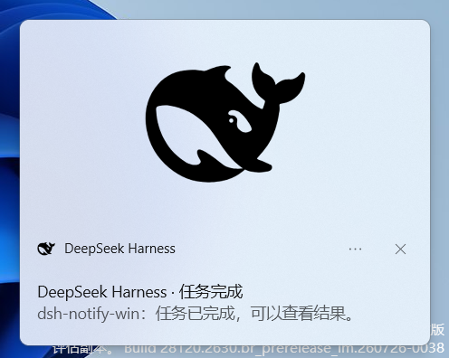
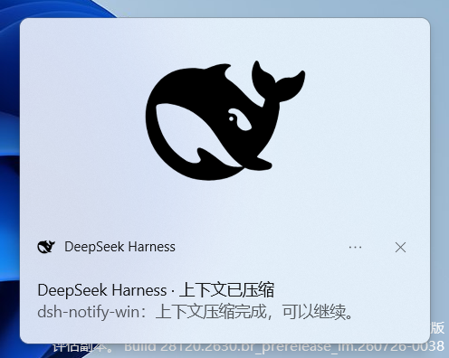
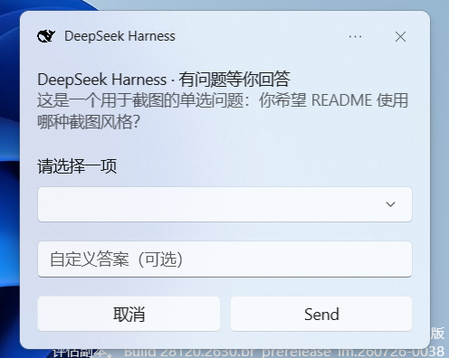
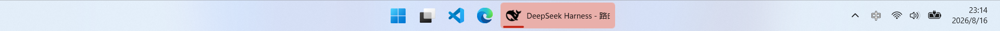

# dsh-notify-win

> DeepSeek Harness (DSH) Windows notification plugin — native toast + taskbar flash when a task finishes or your input is needed.

English | [中文](README.zh.md)


## 📸 Screenshots

### Task finished



### Context compacted



### Question — single select



### Toast timeout → taskbar flash



> Screenshots are from Windows 11. The taskbar flash is animated; the screenshot shows the DSH taskbar button highlighted by the system warm pulse.

## ✨ Features

- 🔔 **Native Windows toast** (bottom-right, Win10/11 system style)
- 💡 **Taskbar flash** (`FlashWindowEx`) when DSH is in the background
- 🖱️ **Click-to-focus** — clicking a toast opens DSH and switches to the corresponding session
- ✅ Triggers when a **task finishes** (root agent goes `idle`)
- 🗜️ Triggers when **context compaction finishes** (`session/event` → `compaction/end`)
- ❓ Triggers when **your input is needed** (approval / `ask_user_question`)
- 📋 **Single-select question toast**: native dropdown with up to 5 options + “自定义答案” (custom answer) text input + Cancel / Send
- ⏰ **Timeout flash fallback**: if an interactive toast is ignored and dismissed by the system timeout, the taskbar flashes so the pending question is not missed
- 🖼️ Hero banner with the DeepSeek Harness logo (light/dark theme aware)
- 🚀 Fire-and-forget: no service, no model approval, no settings namespace

## 🚀 One-line install

```powershell
dsh plugin --profile web add dsh-notify-win
```

> Requires `pnpm` on PATH (`corepack enable` if missing). See [Install](#install) for details.

## Install

1. **Prerequisite: pnpm**

   ```powershell
   corepack enable
   ```

   Or without admin, put a user-level shim in a PATH directory:

   ```powershell
   Set-Content -Path "$env:LOCALAPPDATA\Microsoft\WindowsApps\pnpm.cmd" -Value "@echo off`r`ncorepack pnpm %*`r`n"
   corepack pnpm --version
   ```

2. **Install the plugin**

   ```powershell
   # From npm (recommended)
   dsh plugin --profile web add dsh-notify-win

   # Or directly from GitHub:
   dsh plugin --profile web add github:Andyqwe44/dsh-notify-win

   # If github: is blocked, use SSH:
   dsh plugin --profile web add git+ssh://git@github.com/Andyqwe44/dsh-notify-win.git
   ```

3. **Verify**

   ```powershell
   dsh --profile web --dump-config   # look for: # == dsh-notify-win / - id: dsh-notify-win
   ```

4. **Restart and test**

   ```powershell
   dsh web
   ```

   Complete any task. The first notification self-registers the branded toast identity (Start Menu shortcut + AppUserModelID, one-time). If the toast header still shows `DeepSeekHarness` without an icon, restart Explorer once:

   ```powershell
   Stop-Process -Name explorer -Force; Start-Process explorer
   ```

## Requirements

- Windows 10/11
- DeepSeek Harness, any profile (`web` recommended)
- PowerShell 7 or Windows PowerShell 5.1 (5.1 is used automatically as fallback)
- .NET 10 Desktop Runtime (x64) — only needed for **interactive question toasts** (`ask_user_question`); done/compact toasts use PowerShell and do not require it

## Configuration

Edit `$env:USERPROFILE\.dsh\profiles\web\cordis.patch.yml`:

```yaml
- id: dsh-notify-win
  config:
    doneTitle: 'DeepSeek Harness · Task complete'
    doneBody: 'Your task has finished.'
    compactTitle: 'DeepSeek Harness · Context compacted'
    compactBody: 'Context compaction finished, you can continue.'
    questionTitle: 'DeepSeek Harness · Action needed'
    questionBody: 'An approval or decision is waiting.'
    askTitle: 'DeepSeek Harness · Question for you'
    askBody: 'The assistant asked you something.'
    dedupMs: 1500              # suppress duplicate notifications within this window
    showProject: true          # prefix body with project label
```

To disable:

```yaml
- id: dsh-notify-win
  disabled: true
```

Restart after install/disable changes (web profile HMR is disabled by default).

## How it works

| Concern | Implementation |
| --- | --- |
| Trigger "done" | `agent/status` event with `status: 'idle'` (root agents only) |
| Trigger "compact" | `session/event` → `compaction/end` (no error) |
| Trigger "question" | `approval/request` waterfall + `tools/execute` for `ask_user_question` |
| Done/compact toast | WinRT `Windows.UI.Notifications` via `notify.ps1` with hero banner, falls back to `NotifyIcon` balloon |
| Interactive question toast | .NET helper `dsh-toast-question.exe` (reads dropdown/text input and posts the answer back to the host) |
| Taskbar flash | `EnumWindows` + `FlashWindowEx` (`FLASHW_TRAY \| FLASHW_TIMERNOFG` = 14) |
| Execution | Fire-and-forget subprocess (`powershell` / `dsh-toast-question.exe`) |

The plugin registers no service, tool, or settings namespace — a plain consumer row, safe in any profile.

## Known limitations

- Native toast text is compact: only about 4 lines are displayed, so long content is truncated.
- The native selection dropdown may collapse when the pointer moves onto the popup; if the toast is then dismissed by timeout, the taskbar flash still reminds you.
- `FlashWindowEx` uses the system's warm-pulse highlight; custom colors are not possible.
- Windows never flashes the foreground window — the taskbar button only flashes when DSH is in the background.
- Cancelling a running turn also goes `idle`, so a cancelled task still triggers the "done" toast.
- Notifications are deduplicated per session within `dedupMs` (default 1500 ms).
- Interactive question toasts require the .NET 10 Desktop Runtime on the machine.

## Development

```powershell
npm run check     # syntax check
npm test          # logic smoke test (mocked ctx)

# Show a real toast + taskbar flash:
powershell -NoProfile -File lib/notify.ps1 -Kind done -Title "test" -Body "test"

# Rebuild the interactive question helper:
dotnet publish src/DshToastQuestion/DshToastQuestion.csproj -c Release -r win-x64 --self-contained false -p:PublishSingleFile=true -o lib
```

## Project layout

```
dsh-notify-win/
├── lib/
│   ├── index.js               # Host half: event listeners -> subprocess spawn
│   ├── client.js              # Browser-side click-to-focus / answer polling
│   ├── notify.ps1             # Done/compact toast + taskbar flash
│   ├── focus-dsh.ps1          # Focus/launch the DSH Edge PWA
│   ├── focus-dsh.vbs          # Hidden launcher for focus-dsh.ps1
│   ├── dsh-toast-question.exe # Interactive question toast helper (C#)
│   └── dsh-*.png / dsh-*.ico  # Branding assets
├── src/DshToastQuestion/
│   ├── Program.cs             # C# helper source
│   └── DshToastQuestion.csproj
├── test/
│   ├── smoke.mjs              # Plugin logic smoke test
│   └── headless-overlay.yml
├── docs/
│   └── assets/screenshots/    # README screenshots
├── cordis.patch.yml           # DSH bundle patch
├── package.json               # dsh.bundle declaration
├── README.md
└── README.zh.md
```

## Links

- 🌐 Landing page: https://Andyqwe44.github.io/dsh-notify-win/

## Roadmap

- **V1 (implemented)**: done + compact + question toasts; single-select dropdown with custom answer; Cancel / Send; timeout → taskbar flash fallback.
- **V1.1 (experimental / not stable yet)**: multi-select question toast by numbered input.
- **V2 (planned)**: fully self-contained packaging (no .NET runtime install) and/or background activation so toast buttons submit without any foreground activation.

## License

[MIT](LICENSE)
